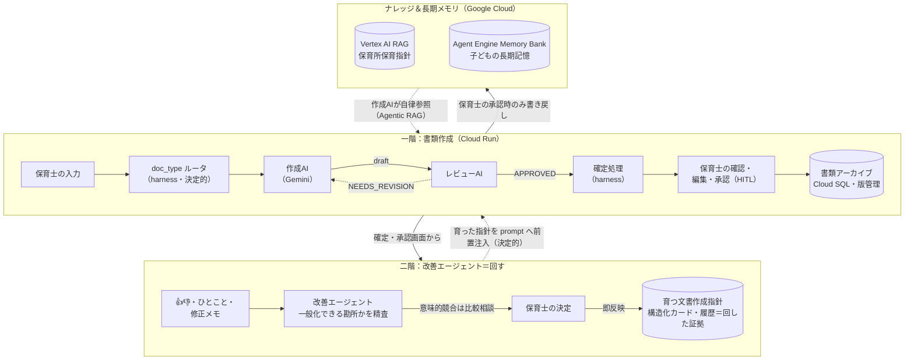
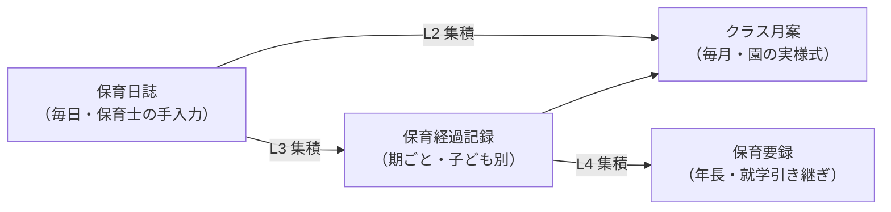

<div align="center">

# HOIKUAGENT

**保育士の勘所を吸収して「回す」、保育書類作成支援 AI エージェント**

[](https://github.com/soichiGogo/hoiku-agent/actions/workflows/ci.yml)
[](LICENSE)


DevOps × AI Agent Hackathon 2026 提出プロダクト

📄 Zenn 記事（準備中）｜🎬 デモ動画（準備中）

</div>

---

## HOIKUAGENT とは

保育士は毎日の保育のかたわらで、日誌・月案・保育経過記録・保育要録といった**書類の連なり**を書き続けています。HOIKUAGENT は、この書類作成を支援する AI エージェントです。価値の核（北極星）は次の一点：

> **「どんな文書にも対応できる」ではなく、保育士の勘所を吸収し、改善サイクルによる文書の高度化を通じて、保育士が手間をかけず子どもと本気で向き合える環境を整備する。**

合言葉は **「生成は土台、価値は改善サイクル＋個別化＋10の姿」**。書類を自動生成すること自体ではなく、現場のフィードバックで文書が育ち続ける仕組みに価値を置いています。

## ハッカソン主論点への回答

### ① なぜ「エージェント」でなければならないか

保育書類の核心は「子どもの姿 → ねらい・評価文」への変換ですが、この判断手順は制度（保育所保育指針）に定義されていません。だから固定のワークフローでは書けず、**不足情報を自分で取りに行く動き**が要ります。

- 作成AIが **保育所保育指針の該当箇所**（Vertex AI RAG）、**その子の育ちの履歴**（Agent Engine Memory Bank）、**園に蓄積された勘所**（育つ文書作成指針）を自律的に参照して下書きを作る
- **作成AI × レビューAI の二軸**が APPROVED まで巡回し、最終確定は必ず保育士（Human-in-the-Loop）

### ② テーマ「回す」の具現化

書類を作るたびに、改善サイクルが自然に回ります。

- 確定・承認画面の **👍👎＋ひとことフィードバック**や修正メモを、**改善エージェント**が「園として一般化できる勘所か」を精査して**育つ文書作成指針（構造化カード）**への追加・改訂として提案
- 既存カードと意味的に競合すれば**保育士に比較相談**し、保育士の決定で**即反映**。カードの変更履歴が「回した証拠」
- 反映されたカードは次の生成から **prompt に決定的に前置注入**される（作成AI・レビューAIの与件になる）
- 別系統で **eval ゲート**（3軸 rubric judge・main 比の非劣化チェック）が CI として品質回帰を監視 — 現場のループと開発のループの**二重の「回す」**

## アーキテクチャ

一階（書類作成）と二階（改善）の**二階建て**。責務は3つに素直に分離し、多層マルチエージェントにはしません。



| 責務 | コード | 役割 | 性質 |
|------|--------|------|------|
| ① 型の保証 | `harness/` | 必須欄・年齢分岐（0–2/3–5）・巡回制御・集積・様式整形。決定ロジックの唯一の実装 | 決定的 |
| ② 中身の決定 | `agents/` | 作成AI（書類別）＋レビューAI＋校正AI。不足情報を自分で取りに行く（Agentic RAG） | Agentic |
| ③ 回す | `improver/` | フィードバック→育つ指針カードの提案。意味的競合は保育士に比較相談・決定で即反映 | Agentic |

### 書類の集積階層 — 下流ほど AI の主戦場

保育書類は単発ではなく、日々の記録が上位文書へ集積されていく構造を持ちます。HOIKUAGENT はこの階層をそのまま実装しています。



- **保育日誌は保育士の手入力**（現場ヒアリングより：日誌は自分の言葉で書く一次情報。AI は校正AIとして日本語チェック・言い換え**提案のみ**を返す＝**AI は著者ではなく校正者**）
- 下流の**クラス月案・保育経過記録・保育要録**が AI 生成の主戦場。過去の確定書類をアーカイブから自動集積して下書きを作る

## 主な機能

- **4種の書類パイプライン**：クラス月案（区分×領域グリッドの園実様式）／保育経過記録／保育要録＋手入力日誌。全年齢対応（0–2歳＝3つの視点／3–5歳＝5領域の年齢分岐）
- **保育士向け配布 UI**（`/app/`）：書類を作る・育てる（指針＋表記ルール）・クラス・園児（名簿）・書類を見る（アーカイブ閲覧/編集/再承認）の4タブ
- **園の帳票そのままの出力**：帳票 PDF（確認印欄つき・A4 縦/横）／園の実 Word 様式への流し込み .docx
- **既存書類の取り込み**：PDF/Word/Excel を抽出AIで構造化し、以後の生成の集積元として活用（生ファイルは保存しない）
- **ひらがな表記DX**：「子供→子ども」等の表記統一を確定時に決定的に適用（保育士が育てる編集辞書・取りこぼしゼロ）
- **子どもの長期記憶**：Memory Bank への書き戻しは**保育士の明示承認＋型成立のときだけ**（真の承認ゲート）
- **品質回帰 eval ゲート**：3軸 rubric（指針整合・10の姿・保護者向け表現）で採点し、main 比の非劣化を CI で担保
- **本番運用ハードニング**：Cloud Run scale-to-zero・WIF 鍵レス CD・DB migration の自動適用・構造化 JSON ログ・Cloud Trace スパンエクスポート・アプリ内 Google ログイン

## 技術スタック

| 役割 | 採用 |
|------|------|
| エージェント実装 | **Google ADK**（Python, コードファースト） |
| LLM | **Gemini**（Vertex AI 経由） |
| 独自ナレッジ検索 | **Vertex AI RAG Engine**（保育所保育指針・10の姿） |
| 長期メモリ・セッション | **Agent Engine**（Memory Bank / Sessions） |
| 書類アーカイブ・育つ指針 | **Cloud SQL**（PostgreSQL・版管理・承認証跡） |
| デプロイ | **Cloud Run**（scale-to-zero・アプリ内 Google Sign-In） |
| CI/CD・可観測性 | **GitHub Actions**（WIF 鍵レス）＋ **Cloud Trace** / Cloud Logging |

## ディレクトリ構成

各ディレクトリの詳細な責務は `docs/architecture.md`、各層の開発規約は当該 `CLAUDE.md` を参照。

```
src/hoiku_agent/
├── agent.py       … root_agent＝doc_type 分岐ルータ（クラス月案/保育経過記録/保育要録）
├── harness/       … ① 型の保証（決定的）：必須欄・年齢分岐・巡回制御・集積（L2/L3/L4）・
│                     指針/表記/様式ストア・書類アーカイブ（Cloud SQL）
├── agents/        … ② 中身の決定（agentic）：作成AI（書類別）・レビューAI・校正AI・抽出AI
├── improver/      … ③ 回す（二階・別エントリ）：フィードバック→育つ指針カードの提案・即反映
├── tools/         … エージェントのプリミティブ（RAG 検索・子ども記憶・HITL・自己点検）
├── schemas/       … 書類スキーマ・指針カード・年齢分岐・10の姿タグ（pydantic 集約）
└── web/           … 保育士向け配布 UI（SPA /app/）：手入力日誌・生成フロー・帳票PDF/Word・
                      指針を育てる・アップロード取込・フィードバック導線
knowledge/         … 育つ文書作成指針・表記ルール・様式テンプレート（シード）＋ RAG ソース（gitignore）
eval/              … 品質回帰ゲート：評価セット＋3軸 rubric judge＋ゲート判定（run_gate.py）
docs/              … 設計コンテキスト / architecture（コード対応） / ライブ実行手順
migrations/        … 書類アーカイブの Alembic スキーマ移行
tests/             … 決定ロジック単体 / 決定論E2E（FakeLlm 注入・LLM 非依存） / eval ゲート判定
infra/             … Terraform でプラットフォーム基盤を宣言化（API/SA・IAM/WIF・Cloud SQL・Secret 器・DNS・ドメインマッピング・AR）。アプリのデプロイは deploy.yml が所有＝境界（infra/README.md）
Dockerfile /.github… Cloud Run 配信 ＋ CI（決定論 ci / deploy / eval-gate / infra=terraform）
```

## セットアップ

```bash
# 依存（uv 推奨。pip でも可）
uv sync            # or: pip install -e .

# GCP 認証 & 設定
cp .env.example .env   # PROJECT_ID 等を記入
gcloud auth application-default login

# 本番と同じ入口で起動（保育士UI = http://localhost:8000/app/）
uvicorn server:app
# AGENT_ENGINE_ID / RAG_CORPUS / DATABASE_URL が未設定でも安全に降格して動く
# 本番は Google Sign-In を設定し、LLM 利用枠（個人: 1時間1000円／全体: 1日10000円）を DB で管理

# ADK CLI / dev UI で対話する場合
adk run src/hoiku_agent      # CLI 対話（既定＝クラス月案）
adk web src                  # ブラウザ UI（agents dir = src/）
```

書類別のデモ入口（アーカイブ未接続時はサンプル seed へ降格）：

```bash
uv run python scripts/run_class_monthly.py --age-band 0-2 --month 2026-07          # クラス月案
uv run python scripts/run_child_record.py --child-id はるとくん --period 2026-04〜2026-06  # 保育経過記録
uv run python scripts/run_youroku.py --child-id はるとくん --fiscal-year 2026       # 保育要録
```

テストは LLM/GCP 非依存の決定論で回ります：

```bash
uv run --extra dev pytest    # 決定ロジック単体＋決定論E2E（FakeLlm）＋eval ゲート判定
ruff check .
```

実 LLM で動かす詳細手順（Vertex AI / AI Studio の2経路・GCP プロビジョニング・トラブルシュート）は
[`docs/ライブ実行手順.md`](docs/ライブ実行手順.md) を参照。

## ドキュメント

| ドキュメント | 内容 |
|------|------|
| [`docs/設計コンテキスト.md`](docs/設計コンテキスト.md) | 設計判断の根拠（なぜそうするか）を残した開発ハンドオフ |
| [`docs/architecture.md`](docs/architecture.md) | 設計↔コードの対応（レイヤ・関数レベルの索引） |
| [`docs/ライブ実行手順.md`](docs/ライブ実行手順.md) | 実 LLM・GCP での実行手順とプロビジョニング |

## ライセンス

[MIT](LICENSE)
