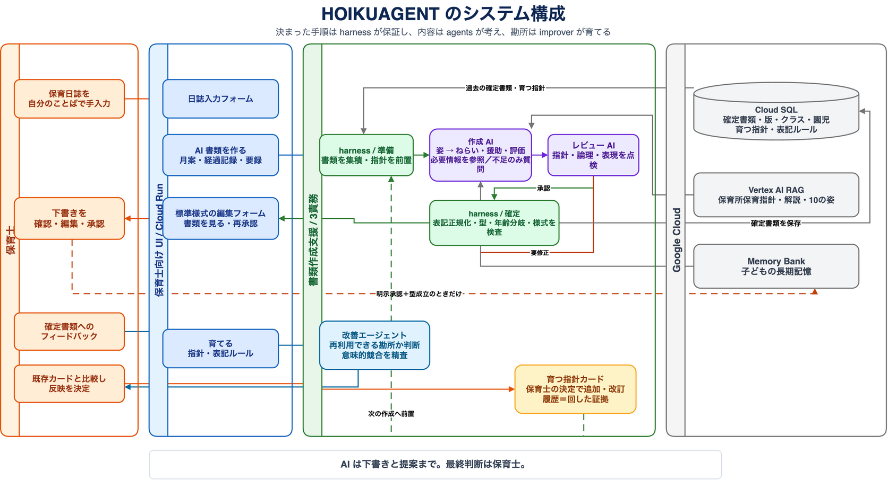
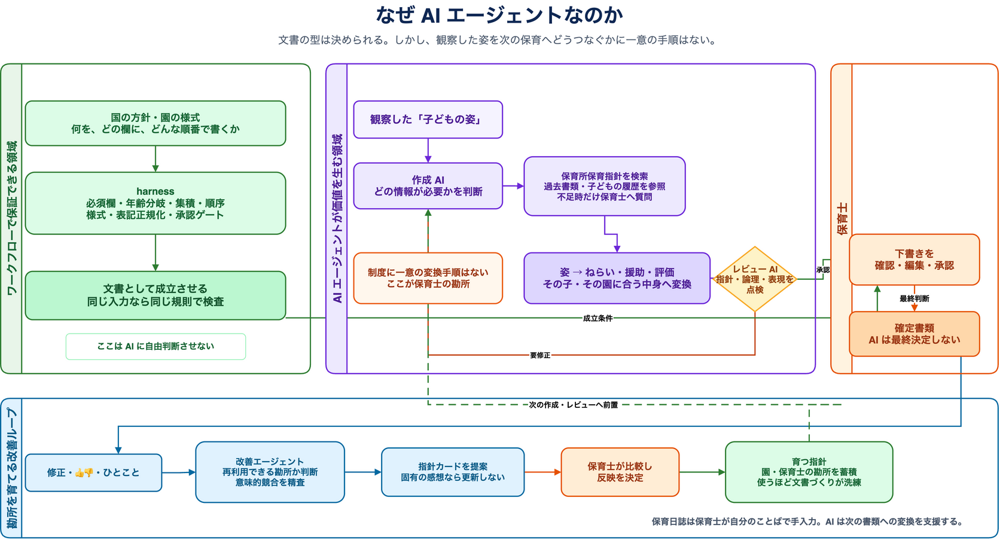

<div align="center">

# HOIKUAGENT

### 保育士の勘所を吸収し、書類づくりを育て続ける保育書類作成支援 AI エージェント。


[](https://github.com/soichiGogo/hoiku-agent/actions/workflows/ci.yml)
[](LICENSE)


DevOps × AI Agent Hackathon 2026 提出プロダクト

[課題と価値](#課題と価値) · [なぜエージェントか](#なぜエージェントか) · [システム構成](#システム構成) · [技術的な工夫](#技術的な工夫) · [つくるまわすとどける](#つくるまわすとどける) · [ローカルで試す](#クイックスタート)

</div>

---

## 課題と価値

保育士は毎日の日誌から、クラス月案、保育経過記録、保育要録まで、国の保育指針に従って子どもの育ちを連続した書類に残します。けれど日誌にある一人ひとりの姿を、発達段階や園の方針に沿って次の書類へつなぐ作業には、時間と熟練した判断が必要です。

HOIKUAGENT は、保育日誌（毎日の児童の姿の記録）を AI が代筆するサービスではありません。日誌は保育士が自分のことばで入力し、AI は**過去の確定書類・子どもごとの長期記憶**を手がかりに、国の保育指針・園/保育士の指針に沿って次の書類を作成します。

> **目指すもの** — 書類作成の業務時間を短縮し、保育士が**子どもとの関わりに時間を注げる**ようにしながら暗黙知が共有されることで、**書類そのものの質も高める**

### 4つの書類を、ひとつの記録の流れに

| 書類         | どんな書類か                                        | HOIKUAGENTでの作成方法                                    |
| ---------- | --------------------------------------------- | --------------------------------------------------- |
| **保育日誌**   | その日一日の保育内容や子どもの様子を記録する日々の記録簿。                 | 保育士がフォームに手入力。AI は校正の提案、業界一般の暗黙知となっている表記ルールのチェックを行う。 |
| **クラス月案**  | 月ごとの保育計画。ねらい（目標）、活動内容、配慮事項などを定める。             | AI がユーザーの定めるクラス月案の作成指針に従って書類を閲覧し作成。                 |
| **保育経過記録** | 子ども一人ひとりの発達や成長の過程を、一定期間(月ごとや期ごとなど)を通して記録するもの。 | AI がユーザーの定める保育経過記録の作成指針に従って書類を閲覧し作成。                |
| **保育要録**   | 子どもが小学校に就学する際に、保育所から小学校へ引き継がれる公的な記録文書。        | AI がユーザーの定める保育要録の作成指針に従って書類を閲覧し作成。                  |


## なぜエージェントか

保育書類の「何を、どの欄に、どんな順番で書くか」は、保育所保育指針や様式で定められています。必須項目、年齢による分岐、書類どうしの集積、承認の手順は、決定的な**ワークフロー型システム**として確実に支えるべき領域です。

一方で、観察した「子どもの姿」を、次のねらい・援助・評価へどうつなげるかの答えは、国の方針に一意には書かれていません。目の前の子どものこれまでの育ちやその日の姿をどう読み取り、何を大切に記録するか。ここにあるのが、保育士それぞれの経験から培われた**勘所**です。

HOIKUAGENT は、定型の手順を AI に任せるためのものではありません。ワークフローで守るべき土台の上で、書類の種類・発達段階・過去の記録・園の方針を踏まえ、この勘所が必要になる変換を支援するために AI エージェントを使います。

- **必要な情報を判断して取りに行く**：作成 AI は保育所保育指針を検索し、子どもの履歴を参照します。
- **不足を推測で埋めない**：書類の質を左右する不足だけを保育士に質問します。
- **出力を自分で終わらせない**：レビュー AI の指摘を受けて再作成し、最終判断は保育士に渡します。

さらに改善エージェントが、保育士の修正やフィードバックから園・保育士ごとに再利用できる勘所を見つけ、指針カードとして追加・改訂を提案します。反映を決めるのは常に保育士です。使うほどに現場の判断を吸収し、その園らしく、より洗練された文書づくりを支えます。

つまり、単発の文章生成ではなく、定型部分はワークフローで保証しながら、状況に応じて**参照・質問・再作成・学習提案**を行う AI エージェントとして設計しています。

## システム構成



保育士は独自ドメインからアクセスし、アプリ内 Google Sign-In で本人確認します。Cloud Run 上の HOIKUAGENT が UI・API・AI エージェントを提供し、Cloud SQL が利用者ごとの園児・クラス・書類・指針・フィードバック・利用枠を保存します。DB 接続情報は Secret Manager から安全に注入します。

文書生成は Gemini、公式資料の検索は RAG Engine、子どもの長期記憶とインスタンスをまたぐ作成セッションは Agent Engine が担います。GitHub Actions は WIF で用途別のサービスアカウントを借用し、Cloud Build でビルドしたコンテナを Artifact Registry に保存して Cloud Run へ配信します。Terraform は基盤を宣言管理し、state を Cloud Storage に保存します。子どもの長期記憶への書き戻しは、**保育士の明示承認と型の検査を通った場合だけ**行います。

| レイヤ | 担当 | 役割 |
| --- | --- | --- |
| `harness/` | 型と手順を保証する決定的な層 | 必須欄・年齢分岐・集積・様式・承認ゲートを一箇所で管理 |
| `agents/` | 内容を考える AI の層 | 書類別の作成 AI、レビュー AI、校正 AI、取込抽出 AI |
| `improver/` | 園の勘所を育てる層 | フィードバックを一般化し、指針カードの追加・改訂を提案 |

### AI エージェントの仕組み



`harness/` が書類の成立条件を保証し、育つ指針、過去書類・名簿、公式指針、子どもの長期記憶を安全に参照できる形で用意します。作成 AI は状況に必要な情報を選び、不足があれば保育士に質問し、観察した子どもの姿をねらい・援助・評価へ変換します。

レビュー AI は下書きを別の観点から点検します。`NEEDS_REVISION` なら作成 AI が指摘を受けて再作成し、最大 3 回まで巡回します。`APPROVED` または巡回上限への到達後、`harness/` が型・年齢分岐・様式を検査します。**AI が最終確定することはなく、保育士の確認・編集・承認を経て確定**します。修正・ひとことフィードバックは別系統の改善エージェントへ渡り、再利用できる勘所だけを指針カードとして提案します。反映は保育士が決め、次回の作成へつながります。

## 技術的な工夫

| 工夫 | 内容 |
| --- | --- |
| **evalゲート＝AIの書きぶりの回帰テスト** | 出力品質を3軸ルーブリック（指針整合・10の姿・保護者向け表現）で LLM-as-judge が採点し、main 比の非劣化を CI のマージ条件にする。判定基準は [`gate_policy.json`](eval/gate_policy.json) に決定的に定義し、比較基準（baseline）は分岐元コミットから取得して PR 側の基準改変を防ぐ |
| **承認と Memory Bank の整合性** | 保育士が承認すると、承認版の事実欄だけを子ども別の fact へ変換して Memory Bank に同期し、成功後に承認を確定する。失敗時は承認を保留し、同じ版の二重反映も防ぐ——AI の未確認出力が記憶を汚染しない構造保証 |
| **参照の検証可能性** | 参照候補は `harness/` が収集して安全に用意し、作成 AI の取得実績は manifest に記録する。どのソースを参照するかの方針（reference_policy）は保育士が編集でき、改善エージェントも変更を提案する |
| **決定論E2Eテスト** | FakeLlm 注入により、レビュー差し戻し巡回・HITL・承認ゲートの全経路を LLM / GCP 非依存で毎 PR 検証する（無料・高速・決定的）。[tests/test_e2e/](tests/test_e2e/) |
| **安全な降格（graceful degradation）** | RAG・Memory Bank・Cloud SQL が未設定でも該当機能だけを安全に降格して起動する。採点不能・保存失敗は「偽の緑」を出さず正直に表示する |
| **公開デモのコスト防御** | LLM を呼ぶ API は、Google Sign-In のユーザー別時間枠と全体の日次枠を DB で原子的に予約してから通す（`llm_budget`） |
| **可観測性** | 構造化 JSON ログ＋ Cloud Trace で、エージェント・LLM・ツール呼び出しの軌跡を 1 リクエスト単位で追跡できる |

## つくる・まわす・とどける

| 軸 | プロダクトでの実装 | 確かめられること |
| --- | --- | --- |
| **つくる** | Google ADK の作成 AI・レビュー AI・HITL。RAG と子どもの履歴を状況に応じて参照し、下書きを巡回改善 | [AI エージェントの仕組み](#ai-エージェントの仕組み)と[決定論E2E](tests/test_e2e/) |
| **まわす** | ひとことフィードバック → 改善エージェント → 指針カード提案。競合は保育士に比較相談し、3軸 eval が品質回帰を監視 | [eval README](eval/README.md) と [eval gate workflow](.github/workflows/eval-gate.yml) |
| **とどける** | 独自ドメインの Cloud Run、アプリ内 Google ログイン、ユーザーごとのデータ領域、WIF・Cloud Build・Artifact Registry による鍵レス配信 | [CI](.github/workflows/ci.yml)、[deploy workflow](.github/workflows/deploy.yml)、[インフラ](infra/README.md) |

### 「作る」と「育てる」の二つの循環

1. **作る** — 記録を集積し、作成 AI とレビュー AI が下書きを整えます。保育士が確認・編集・承認して確定します。
2. **育てる** — ひとことフィードバックと修正メモを改善エージェントが読み取り、園として再利用できる勘所だけを指針カードとして提案します。競合する判断は保育士に比較相談します。
3. **守る** — 指針変更やモデル変更は、3軸の eval ゲート（指針整合・10の姿・保護者向け表現）で main 比の品質非劣化を確認します。

## 保育の記録を扱うための境界

- **AIは下書きと提案に徹する**：確認・編集・承認による最終判断は保育士が行います。
- **記憶は承認後にだけ育つ**：保存済み現行版を保育士が承認すると、子どもの事実欄だけをMemory Bankへ
  反映し、成功後に書類を承認済みにします。同じ版は二重反映せず、編集後の新版は再承認で更新します。
- **データを分けて守る**：アプリ内 Google ログインとユーザーごとのデータ領域で、書類・園児・フィードバックを分離します。
- **表記を決定的にそろえる**：表記ルールは確定時に適用し、AI の提案とは別の仕組みで取りこぼしを防ぎます。
- **実データをリポジトリに残さない**：開発・eval には実在しない仮名だけを使い、秘密情報と保育書類はコミットしません。

## できること

| 保育士の画面 | できること |
| --- | --- |
| **書類を作る** | 手入力の日誌、クラス月案、保育経過記録、保育要録をひとつの入口で作成。帳票 PDF と園の Word 様式を出力 |
| **育てる** | 指針カードと、`子供 → 子ども` のような表記ルールを保育士が編集。フィードバックから改善案も作成 |
| **クラス・園児** | クラスと園児を管理し、日誌入力時に在籍児を表示 |
| **書類を見る** | 確定済み書類の閲覧・編集・再承認。PDF / Word / Excel の既存書類を取り込み、以後の集積に利用 |

## 技術スタック

| 領域 | 採用技術 |
| --- | --- |
| エージェント | Google ADK / Python / Gemini on Vertex AI |
| 知識・長期記憶 | Vertex AI RAG Engine（保育所保育指針の告示・解説・10の姿・要録関係資料）/ Agent Engine Memory Bank・ADK 共有セッション |
| 記録・指針 | Cloud SQL for PostgreSQL / Alembic |
| UI・帳票 | FastAPI / 保育士向け SPA / ReportLab / python-docx |
| 実行基盤・認証 | Cloud DNS / Cloud Run Domain Mapping / Cloud Run / Docker / アプリ内 Google Sign-In / Secret Manager |
| 配信・基盤管理 | GitHub Actions / Workload Identity Federation / Cloud Build / Artifact Registry / Terraform / Cloud Storage |
| 品質・可観測性 | 決定論テスト・eval ゲート / Cloud Logging / Cloud Trace |

## クイックスタート

前提: Python 3.11 以上、[uv](https://docs.astral.sh/uv/)、実際に AI を呼び出す場合は Google Cloud の認証情報。

```bash
# 依存関係を用意
uv sync

# ローカル設定を作成（秘密情報はコミットしない）
cp .env.example .env

# 保育士向け UI を起動
uvicorn server:app
```

ブラウザで [http://localhost:8000/app/](http://localhost:8000/app/) を開きます。`RAG_CORPUS`、`AGENT_ENGINE_ID`、`DATABASE_URL` が未設定でも、該当機能を安全に降格して起動できます。AI を使う前には、`.env` を設定して `gcloud auth application-default login` を実行してください。本番ではアプリ内 Google Sign-In と、個人・全体の LLM 利用枠を DB で管理します。

### テスト

LLM や GCP に依存しない決定論テストを実行できます。

```bash
uv run --extra dev pytest
ruff check .
```

実際のモデルでの動作確認、RAG / Memory Bank / Cloud SQL の準備、Cloud Run へのデプロイは [ライブ実行手順](docs/ライブ実行手順.md) を参照してください。

## 設計ドキュメント

| ドキュメント | 内容 |
| --- | --- |
| [設計コンテキスト](docs/設計コンテキスト.md) | プロダクトの北極星と、設計判断の根拠 |
| [アーキテクチャ](docs/architecture.md) | レイヤ、コード、データフローの対応 |
| [ライブ実行手順](docs/ライブ実行手順.md) | 実 LLM / GCP での実行・プロビジョニング手順 |
| [eval README](eval/README.md) | 品質回帰ゲートの採点と運用 |
| [インフラ README](infra/README.md) | Terraform で管理する GCP 基盤の境界 |

## 開発に参加する方へ

設計の正は、まず [設計コンテキスト](docs/設計コンテキスト.md)、次に [アーキテクチャ](docs/architecture.md) です。実装では `harness/`・`agents/`・`improver/` の責務境界を守り、決定的な判断を複数の場所に重ねないでください。開発時の規約は [AGENTS.md](AGENTS.md) を参照してください。

## ライセンス

[MIT](LICENSE)
